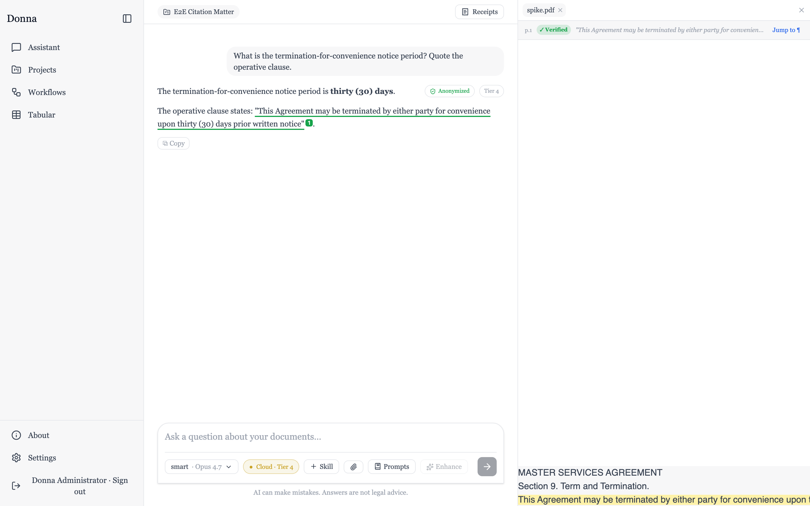

# Donna

**v0.1.0** · Apache-2.0 · a [LegalQuants](https://github.com/LegalQuants) project

**A friendly, document-forward frontend for the [LQ.AI](https://github.com/LegalQuants/lq-ai) legal-AI backend** — conversational legal work with character-verified citations, transparent receipts, and autonomous runs, under a clean reading-first interface inspired by [MikeOSS](https://github.com/willchen96/mike).



Donna is a standalone SvelteKit app that talks to the lq-ai backend only through its published API, and vendors that backend (as a pinned git submodule) so the whole product runs together with one compose file.

## What's inside

- **Assistant chat** with streaming answers and **character-verified citation pills** — hover for the source quote, click to open the document panel jumped to the exact cited passage. A per-turn **receipts drawer** shows every retrieval, inference, and skill event behind an answer, including whether anonymization was applied.
- **Matters (projects)** — scope chats to a matter with files, linked knowledge bases, attached skills, and free-form context; privileged matters enforce a minimum inference tier in the composer.
- **Knowledge bases** — create, link, upload; documents auto-ingest for retrieval (RAG) with live status, hybrid-search tuning, and per-file download.
- **Workflows hub** — four kinds of reuse:
  - **Skills**: reusable instruction blocks with typed inputs; author your own or fork built-ins, attach them per-message (slash aliases supported).
  - **Playbooks**: negotiation positions applied to a contract → verdict scorecard + consolidated redline view; generate a draft playbook from your own documents.
  - **Prompts**: saved snippets inserted at the cursor.
  - **Automations**: runs Donna executes on its own — run-now, cron schedules, and KB-arrival watches — each leaving a transparency receipt (phases, tool calls, cost, terminal reason) plus its results (findings, proposed memories, and recurring precedents), with a notifications inbox. Opted-in runs also produce **document-grade artifacts** — memos the run writes into its target knowledge base, openable inline or downloadable straight from the receipt.
- **Tabular review** — the same questions across many documents → a cited, confidence-scored grid; per-column model-tier floors and ensemble verification; Excel/CSV export.
- **Redlines** — consolidated change-set view of a playbook run with severity-ordered margin notes.
- **Settings** — account & security, data export / scheduled deletion, preferences (incl. ambient trust pills), a read-only trust matrix, and model management: per-category routing, installed local (Ollama) models, and **bring-your-own provider keys** (admin, hot-applied, write-only).
- **Prompt enhance** on every composer, **file attach** in chat, and an in-app guide at **/about** — including interactive playgrounds explaining how the LQ-AI engine works.

## Architecture (one paragraph)

The browser talks only to Donna's SvelteKit server (a **backend-for-frontend**). The SvelteKit server holds the lq-ai JWT access + refresh tokens in **httpOnly cookies**, attaches `Authorization: Bearer` when proxying to the lq-ai `api`, and transparently refreshes on `401`. This means no CORS, and the JWT never reaches client JavaScript. The lq-ai backend is vendored at `vendor/lq-ai` (pinned submodule) and brought up by this repo's `docker-compose.yml`, which `include`s lq-ai's compose and adds Donna's web service (`donna-web`).

## Prerequisites

- **Docker** + Docker Compose v2 (for the bundled backend).
- **Node 22+** (for local dev / tooling).

## Setup

```bash
# 1. Clone WITH submodules (pulls vendor/lq-ai AND its nested skills corpus)
git clone --recurse-submodules https://github.com/LegalQuants/Donna.git
cd Donna
#    (if already cloned without submodules:)
git submodule update --init --recursive
#    NOTE: the --recursive flag matters — the skills corpus (LegalQuants/lq-skills)
#    is a submodule nested INSIDE vendor/lq-ai. Without it the arq-worker has no
#    skills directory and exits at startup by design.

# 2. Install deps
npm install

# 3. Generate the typed API client from lq-ai's OpenAPI specs
npm run gen:api

# 4. Create your env file (dev secrets + host ports)
cp .env.example .env
#    Edit .env: set the required secrets (POSTGRES_PASSWORD, MINIO_ROOT_PASSWORD,
#    S3_*, LQ_AI_GATEWAY_KEY, JWT_SECRET). The *_HOST_PORT values are pre-shifted
#    so Donna can run ALONGSIDE a separate lq-ai dev stack on the default ports.
```

## Quick install (pre-built images)

The fastest way to run Donna — no clone, no submodules, no build. You need only **Docker + Compose v2**.

```bash
# 1. Get the release compose file and an env template
curl -O https://raw.githubusercontent.com/LegalQuants/Donna/main/docker-compose.release.yml
curl -o .env https://raw.githubusercontent.com/LegalQuants/Donna/main/.env.example

# 2. Edit .env — set the required secrets (POSTGRES_PASSWORD, MINIO_ROOT_PASSWORD,
#    S3_*, LQ_AI_GATEWAY_KEY, JWT_SECRET). Pin a release with DONNA_IMAGE_TAG=v0.1.0
#    (default: latest). Add ANTHROPIC_API_KEY / OPENAI_API_KEY for cloud inference,
#    or leave them blank and use a local Ollama model (see Models in the app).

# 3. Start the stack (pulls pre-built images from ghcr.io/legalquants)
docker compose -f docker-compose.release.yml up -d
```

Then create a login-ready admin and sign in (same as below):

```bash
docker compose -f docker-compose.release.yml exec api \
  python -m app.cli reset-admin-password \
  --email admin@lq.ai --password 'DonnaE2ePassw0rd!' --no-force-change
```

Open **http://localhost:13002** and sign in with `admin@lq.ai` / `DonnaE2ePassw0rd!`.

Images are published from this repo to GHCR — `ghcr.io/legalquants/donna-web`, `donna-api`, and
`donna-gateway` (multi-arch: Intel/AMD + Apple Silicon). This still needs a filled `.env`; it removes
the _build_, not the _config_. For a fully free, no-cloud setup, leave the provider keys blank and run
a local model via Ollama. Deploying beyond `localhost` still requires TLS in front of `donna-web` (see
the note under "Run the full stack").

> **Prefer to build from source / develop on Donna?** Use the clone + build instructions below.

## Run the full stack

Donna runs as its own compose project (`donna`) on **shifted host ports**, so it won't collide with a separate lq-ai dev stack running on the defaults:

```bash
docker compose up -d --build postgres redis minio gateway api donna-web ingest-worker arq-worker
```

With the default `.env`, Donna is then at **http://localhost:13002** (the lq-ai `api` is at `http://localhost:18000`). The `ingest-worker` powers document ingestion/RAG and data export; the `arq-worker` powers tabular runs, playbook generation, and automations.

> **Deploying beyond localhost:** the production build sets session cookies with the `Secure` flag, which browsers only store over HTTPS (with a `localhost` exemption). Any non-`localhost` deployment must terminate TLS in front of `donna-web`, or login will silently fail (cookies dropped).

> **Why not `docker compose up` (everything)?** Compose v2 `include:` won't let us override lq-ai's `web` service, so it still exists in the merged spec. Starting the explicit service list above avoids building/running it.

### First-run admin (login-ready fixture)

On first boot the api auto-creates an admin (`admin@lq.ai`) with a random password and `must_change_password=true` (printed to the api logs). For a directly-usable login (dev/test), set a known password and clear the change-password flag with lq-ai's CLI:

```bash
docker compose exec api python -m app.cli reset-admin-password \
  --email admin@lq.ai --password 'DonnaE2ePassw0rd!' --no-force-change
```

Then sign in at http://localhost:13002 with `admin@lq.ai` / `DonnaE2ePassw0rd!`. (To exercise the real first-run flow instead, retrieve the printed password with `docker compose logs api 2>&1 | grep "First-run admin password"` and you'll be routed through the change-password screen.)

## Verify

```bash
npm run check        # svelte-check — 0 errors, 0 warnings
npm run lint         # prettier + eslint
npx vitest run       # unit/component tests
npx playwright test  # e2e — requires the stack up + the admin fixture above
```

The e2e reads `DONNA_BASE_URL`, `DONNA_E2E_EMAIL`, `DONNA_E2E_PASSWORD` from `.env` (or the environment).

> Running `npm run check` prints a harmless `ERR_MODULE_NOT_FOUND` referencing `vendor/lq-ai/...`; svelte-check recovers and the run still reports `0 ERRORS` and exits 0. The vendored backend is excluded from svelte-check/ESLint/Prettier.

## Development (without Docker for the frontend)

```bash
LQ_API_INTERNAL_URL=http://localhost:18000 npm run dev
```

## Layout

```
src/                  SvelteKit app (routes, lib, BFF server code, hooks)
src/lib/server/       server-only: session cookies, authed lqClient, auth wrappers
src/lib/api/          generated OpenAPI types (npm run gen:api)
vendor/lq-ai/         pinned lq-ai backend (git submodule)
docs/                 specs, plans, decisions, upstream requests, research notes
tests/                Playwright e2e
static/learn/         interactive playgrounds served by the /about guide
```

## Documentation

- **[docs/GUIDE.md](docs/GUIDE.md)** — the friendly, non-technical guide: what Donna is, what you can do with it today, how it works in plain terms, and what else you could build on LQ-AI (for practitioners, firms, students, professors, and access-to-justice builders). Start here if you're new.
- **[About Donna — v0.1.0 (PDF)](docs/About-Donna-v0.1.0.pdf)** — a downloadable export of the in-app **About** guide (v0.1.0 · June 8, 2026): a full visual overview of every feature, for readers who'd like the complete tour without standing up the app. The interactive version, with playgrounds, lives at **/about** once Donna is running.
- **[docs/PRODUCT.md](docs/PRODUCT.md)** — what Donna is, who it's for, the full capability set, design principles, and non-goals.
- **[CHANGELOG.md](CHANGELOG.md)** — release history (start at v0.1.0).
- **[CLAUDE.md](CLAUDE.md)** — the engineering guide: architecture, the build workflow, conventions, gotchas, and how to pick up a roadmap item. Written for a coding co-pilot (human or AI) joining the project.
- **[docs/roadmap/donna-future-roadmap.md](docs/roadmap/donna-future-roadmap.md)** — what's deferred and why, with enough context to pick up cleanly.
- **[docs/README.md](docs/README.md)** — index of the `docs/` tree (specs, plans, decisions, upstream requests, research).
- The richest documentation, though, is **in the app itself**: sign in and open **/about** — a full guide with interactive playgrounds explaining how the LQ-AI engine works.

Design specs and implementation plans for every shipped phase live under `docs/superpowers/`; the lq-ai submodule pin log is `docs/decisions/lq-ai-pin.md`.

## License

Apache License 2.0 — see [LICENSE](LICENSE). Copyright (c) 2026 Kevin Keller.

## Acknowledgements

- **[LQ.AI](https://github.com/LegalQuants/lq-ai)** — the legal-AI engine Donna fronts: retrieval, the character-verified citation engine, anonymization, skills/playbooks, tabular review, and the autonomous runtime.
- **[MikeOSS](https://github.com/willchen96/mike)** — the design inspiration for Donna's reading-first, document-forward interface.
- Built with [SvelteKit](https://kit.svelte.dev), [Tailwind CSS](https://tailwindcss.com), and [Claude Code](https://claude.com/claude-code).

> Donna and LQ.AI were initially authored by Kevin Keller and contributed to LegalQuants.
> Comments, corrections, and contributions welcomed via GitHub.
