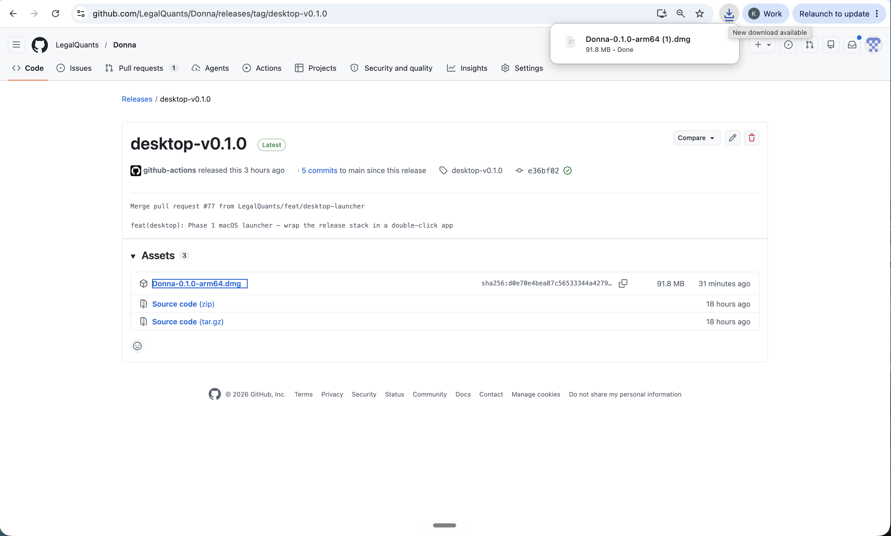
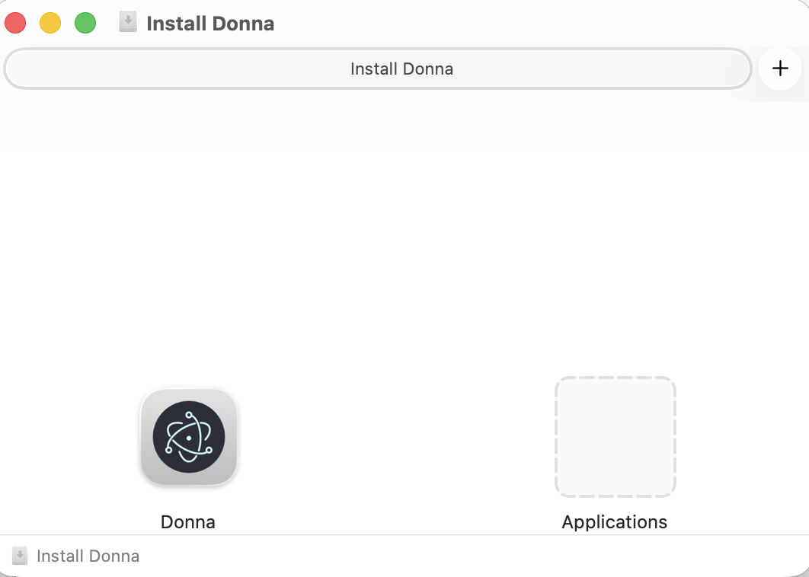
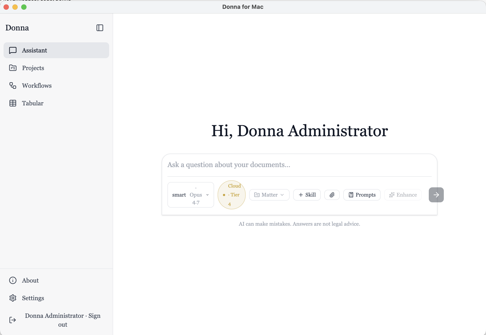
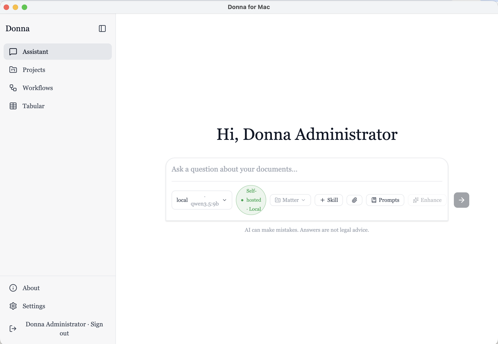

# Install Donna on your Mac

Donna for Mac is a one‑app install: download it, open it, set a password, and you're working — **no
terminal, no GitHub, no config files**. This guide walks through it with pictures.

> **What you need**
> - A **Mac with Apple Silicon** (M1/M2/M3/M4). *(An Intel build is coming.)*
> - **Docker Desktop** installed and running — Donna uses it to run its private engine on your
>   machine. Get it free at [docker.com/products/docker-desktop](https://www.docker.com/products/docker-desktop/).
>   (If Docker isn't installed, Donna will tell you and link you to it.)
> - **~12 GB of free disk** for the engine images, and an internet connection for the first run.

Everything Donna does runs **locally on your Mac**. Your documents never leave your computer unless
you choose a cloud AI model.

---

## 1. Download Donna

Go to the [**latest desktop release**](https://github.com/LegalQuants/Donna/releases/tag/desktop-v0.1.0)
and download **`Donna-0.1.0-arm64.dmg`** (about 92 MB).



---

## 2. Install it

Double‑click the downloaded `.dmg`. A window opens — **drag the Donna icon onto the Applications
folder**. That's it; you can then eject the disk image.



Open Donna from your **Applications** folder (or Launchpad). Because the app is **signed and
notarized by Apple**, it opens normally — no "unidentified developer" warning.

---

## 3. One‑time setup

The first time you open Donna, a short **Welcome** screen appears. Two quick choices:

**1. How should Donna think?** — pick how Donna answers questions:
- **Use a cloud API key (recommended)** — paste an Anthropic API key for the best quality and speed.
  *(Optional — you can leave it blank and add a key later in Settings.)*
- **Run fully local with Ollama** — keep everything on your Mac with no cloud at all. This needs
  [Ollama](https://ollama.com) installed and running with a model pulled (e.g. `ollama pull qwen2.5`).

**2. Set your password** — your login is **`admin@lq.ai`** (shown on screen); choose a password of at
least 12 characters. You can change the email and password later in **Settings → Account**.

Click **Start Donna**. The first start **downloads the engine and document‑processing models** — this
takes a few minutes the first time only, and Donna shows live progress (e.g. *"5/8 services
ready"*). When it reaches **Running**, you're set.

> **Note:** those first‑run downloads are Donna's **document‑reading models** (for search,
> highlighting and OCR) — not the chat AI. You don't have to wait for them to finish to start using
> Donna; they keep loading in the background and only matter when you upload documents.

---

## 4. Use Donna

Click **Open Donna** and sign in with **`admin@lq.ai`** and the password you set. You'll land on the
**Assistant**, Donna's home base — ask questions, open Projects, run Workflows, or build Tabular
reviews.

The pill under the question box shows which AI is answering. With a **cloud** key it reads *Cloud ·
Tier 4*:



…and with **local** Ollama it reads *Self‑hosted · Local* — fully private, no cloud:



The richest tour of every feature lives **inside the app** — open **About** in the left sidebar.

---

## Everyday use

The Donna app window is your **control panel**:
- **Open Donna** — opens the workspace (once the engine is Running).
- **Start / Stop** — start or stop the engine. Stopping frees up your Mac's resources; your data is
  kept and is there next time you Start.
- **Logs** — a live view of what the engine is doing, handy if something looks stuck.

You can quit the app when you're done. Re‑opening it goes straight to the control panel — the setup
wizard only runs the very first time.

---

## Troubleshooting

- **"Docker is not running."** Start **Docker Desktop** (look for the whale icon in your menu bar),
  wait until it says *Running*, then click **Start** in Donna.
- **First start is slow.** Normal — the engine images and document models download once. Watch the
  live progress; you can sign in as soon as it says **Running**.
- **Local (Ollama) answers fail or are missing models.** Make sure Ollama is running and you've
  pulled a model (`ollama pull qwen2.5`), then pick it in **Settings → Models**.
- **Forgot your password?** It can be reset from a terminal (advanced):
  ```bash
  docker compose -f "/Applications/Donna.app/Contents/Resources/docker-compose.release.yml" \
    -p donna-desktop --env-file "$HOME/Library/Application Support/donna-desktop/.env" \
    exec -T api python -m app.cli reset-admin-password --email admin@lq.ai --password 'YourNewPass123!' --no-force-change
  ```

---

## Prefer the command line?

If you're comfortable with Docker, you can skip the app and run the same stack directly with
`docker-compose.release.yml` — see **Option B** in the [README](../README.md#quick-install-pre-built-images).
